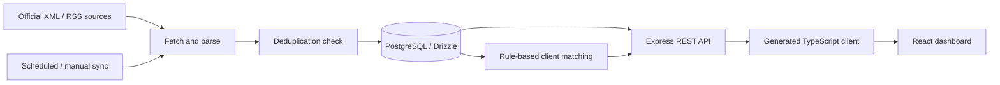

# Gestoría Canarias — Official Bulletin Monitor

**A full-stack TypeScript application for tracking official publications and helping Spanish advisory firms identify changes that may affect their clients.**

The application brings together bulletins from the **BOE**, **BOC**, provincial bulletins for **Tenerife and Las Palmas**, and the **BORME** (Mercantile Registry Bulletin). Instead of checking multiple publications manually, an adviser can browse incoming notices, filter them, save relevant items, and review rules-based matches against client profiles.

**Project focus:** practical business workflows, third-party data ingestion, contract-first APIs, structured data, and an operational dashboard.  
**Interface language:** Spanish. **Code and this case study:** primarily English.

> **Status:** Portfolio/development project. The repository demonstrates implemented application flows; it has **not** been independently verified as a production deployment. The API currently lacks authentication/authorization middleware, so it must **not** be deployed publicly with real client data.

## Product walkthrough

| Area | Implemented functionality |
| --- | --- |
| **Dashboard** | Overview cards for total, today's, unread and bookmarked entries, plus recent publications and alerts |
| **Publications** | Paginated, searchable list; filtering by bulletin source, date and category; individual entry details |
| **Review workflow** | Mark items as read, bookmark them and attach notes |
| **Alerts** | Create category/source alerts and inspect matching publications |
| **Client relevance** | Store client profiles and use rule-based scoring to match publications to relevant clients |
| **Synchronization** | Manually trigger collection and inspect synchronization status/history; an in-process cron is configured for 08:00 |
| **Exports** | CSV and PDF export actions in the React interface |

The latest source also includes **BORME ingestion and company relevance matching**; these features extend the original BOE/BOC/BOP-focused product brief.

### Why I built it

Small advisory firms need to review many official sources while serving clients with different legal forms, sectors, municipalities and obligations. The engineering problem is not just fetching a feed: it is making updates **findable, reviewable and relevant to the client's situation**.

## Live portfolio demonstration (fictional, read-only)

**[Explore the static demo on GitHub Pages](https://maria79.github.io/boletines-oficiales/)**

The demo is a separate React/TypeScript interface with a dashboard, search/source/category filters, fictional bulletin details, synthetic CSV export and an illustrated client-relevance view. It **does not call the Express API**, persist visitor activity or connect to real official bulletin feeds. All example bulletin titles and organizations are fictional.

The [static GitHub Pages deployment finished successfully](https://github.com/Maria79/boletines-oficiales/actions/runs/37999493795) on 9 October 2026; its publish job reported the URL above. An independent visual browser check and screenshots remain recommended. The [static-demo implementation](https://github.com/Maria79/boletines-oficiales/pull/4) is merged into `main`.

Run the demo locally without database credentials or a backend:

```bash
pnpm install --frozen-lockfile
PORT=20210 BASE_PATH=/ VITE_PORTFOLIO_DEMO=true pnpm --filter @workspace/gestoria-canarias run dev
```

See the [read-only demo runbook](docs/READ_ONLY_PORTFOLIO_DEMO.md). The illustrative match scores **are not the backend matching algorithm**, and no demo entry represents an actual legal notice. The full-stack operational API remains **separate from this static demo** and should not be publicly deployed with real client records.

## Architecture



| Layer | Implementation |
| --- | --- |
| Frontend | React, Vite, TypeScript, Tailwind CSS, Wouter, TanStack Query, Recharts |
| API | Node.js, Express 5, Zod request validation, Pino logging |
| Data | PostgreSQL, Drizzle ORM |
| Contracts | OpenAPI specification, Orval-generated React Query hooks and Zod schemas |
| Automation | `node-cron`, XML/RSS fetching and parsing |
| Monorepo | pnpm workspaces, TypeScript project references |

### Engineering decisions worth discussing

**1. Contract-first integration.** The [OpenAPI definition](lib/api-spec/openapi.yaml) is used to generate typed API hooks and validation schemas, helping keep frontend requests and server expectations aligned.

**2. Structured ingestion.** Source-specific fetchers convert different bulletin formats into a common entry shape. The sync process checks source/external ID pairs before insertion and records run results in `sync_logs`. This is **application-level duplicate checking**, not a claim of database-enforced uniqueness or concurrent-sync safety.

**3. Explainable relevance rules.** Matching logic uses signals such as legal form, NIF, CNAE, municipality and configured keywords, with a relevance score and an accompanying reason. This is **rule-based matching**, not an AI model.

**4. Operational visibility.** Structured logs, synchronization history and manual refresh help operators diagnose missing or delayed source updates.

**5. Workflow before automation claims.** The scheduled sync runs **inside the API process** at 08:00 in the host's timezone. For reliable production scheduling, the runtime must remain available and job scheduling/concurrency should be managed appropriately.

## Repository map

```text
artifacts/
  api-server/              Express routes, bulletin fetchers and matching
  gestoria-canarias/        React/Vite application
lib/
  api-spec/                 OpenAPI contract
  api-client-react/         Generated API hooks and request client
  api-zod/                  Generated request/response schemas
  db/                       Drizzle models and PostgreSQL connection
replit.md                   Original operational notes
pnpm-workspace.yaml         Workspace and shared dependencies
```

Key code to inspect: [sync.ts](artifacts/api-server/src/lib/sync.ts), [matching.ts](artifacts/api-server/src/lib/matching.ts), [API routes](artifacts/api-server/src/routes/), [React app](artifacts/gestoria-canarias/src/App.tsx).

## Local development

**Prerequisites:** Node.js 24, pnpm, and a disposable PostgreSQL database. Never connect the demo to real client records without implementing access controls first.

1. Clone this repository and install its workspaces:

   ```bash
   git clone https://github.com/Maria79/boletines-oficiales.git
   cd boletines-oficiales
   pnpm install
   ```

2. Configure a local PostgreSQL `DATABASE_URL` (server-side only), and initialize the development schema:

   ```bash
   DATABASE_URL="postgresql://localhost:5432/gestoria_dev" pnpm --filter @workspace/db run push
   ```

   `push` modifies the target database schema: use it **only** with a development database.

3. Start the API from a terminal where `DATABASE_URL` and `PORT` are configured:

   ```bash
   DATABASE_URL="postgresql://localhost:5432/gestoria_dev" PORT=8080 pnpm --filter @workspace/api-server run dev
   ```

4. In a second terminal, start the frontend:

   ```bash
   PORT=20210 BASE_PATH=/ pnpm --filter @workspace/gestoria-canarias run dev
   ```

   The generated frontend client uses `/api` paths. This repository's Vite configuration has **no built-in proxy**, so a local reverse proxy/routing setup is needed to forward those requests to the API. Replit environments may supply their own routing. Starting two servers alone does not guarantee a working end-to-end setup.

For static checks:

```bash
pnpm run typecheck
pnpm run build
```

The TypeScript check and workspace build **passed in CI on the security-work branches**; that verifies those changes but does not constitute a deployment or end-to-end frontend verification. The current `main` branch has no automated test workflow.

## Current limitations and next improvements

- **Security blocker on the published `main` branch:** client-name/NIF routes and other staff-workflow endpoints do not enforce application authentication. Draft [PR #2](https://github.com/Maria79/boletines-oficiales/pull/2) and [PR #3](https://github.com/Maria79/boletines-oficiales/pull/3) add fail-closed API authorization and real HTTP denial checks, but **remain unmerged** because the current browser UI has no compatible staff-login/session flow. Do not put the server-only API token in browser code, connect real client data or host this as an open multi-user service.
- Add integration tests for ingestion, matching, API validation, authorization and concurrent duplicate prevention; no automated test suite is configured in the root scripts.
- Verify upstream BOE, BOC, BOP and BORME feed availability, parsing and error recovery under real conditions.
- Improve scheduling reliability, source-specific monitoring and database uniqueness constraints.
- Capture genuine browser screenshots of the deployed static demo and verify mobile navigation and accessibility; the fictional demo has deployed, but the operational backend is not an approved public service.
- Validate NIF/NIE checksums and operational rules before using matching decisions in a professional setting.

**Portfolio note:** this repository showcases how I approach a concrete business problem and its full-stack architecture. It is **not** an official BOE, BOC, BOP or BORME service and should not be used as legal advice.
